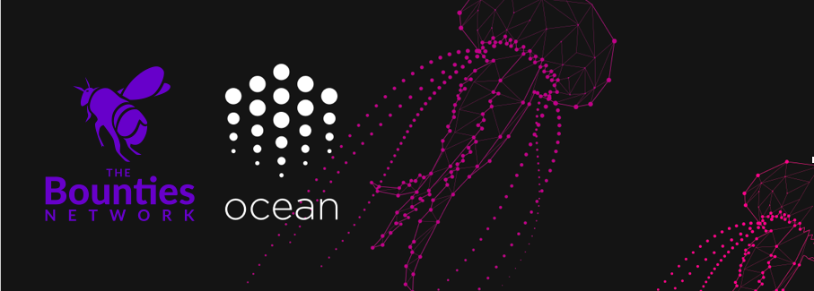

## Introduction

The goal of this Open Bounty program is to involve the bright minds in the open source community to propose solutions around Ocean Protocol. The goal of Ocean is to create a decentralized data exchange protocol to unlock data for AI. We believe in wisdom of the crowd, and the ability of community-driven development to propel us forward. The idea behind Open Bounty program is for you to suggest what features or applications you would like to see and use in the Ocean Protocol ecosystem. 

## How to submit a Open Waters Bounty proposal?

1. Make sure there are no existing Proposals [here](https://github.com/oceanprotocol/openwaters/issues) for something similar to your idea or project. If you think your proposal can improve upon or integrate with existing proposal, reference the existing proposal in `Notes` section in your proposal.

2. If nothing similar exists, create a [new Proposal for bounty](https://github.com/oceanprotocol/openwaters/issues/new) in this Repository, fill it out in detail following the [sample proposal for reference](sample/sample_proposal.md).

3. Once step 2 is done, go to Ocean Protocol's [Open Waters bounty](https://explorer.bounties.network/explorer?bountyStage=active&platform=bounties-network&search=oceanprotocol) on bounties network. You will see one bounty titled **Ocean Protocol Open Waters Bounty**. Click on that bounty.

4. On the bounty page, click on **Fulfill** button. Fill the submission form with correct details and paste link to proposal issue (created in Step 2) in _weblink_ field.

5. Click on _Submit_ button.

## How it works?

1. You will submit a new proposal for the Ocean Protocol's [Open Waters bounty](https://explorer.bounties.network/explorer?bountyStage=active&platform=bounties-network&search=oceanprotocol) on bounties network.

2. We will review the proposal to see if it fits into Ocean Ecosystem and Ocean's Delivery Roadmap.

3. If your proposal is accepted, we will pay out bounty reward over Bounties Network. In case, it is not accepted, we will provide our reasoning and of course, you can propose a new bounty again. 
