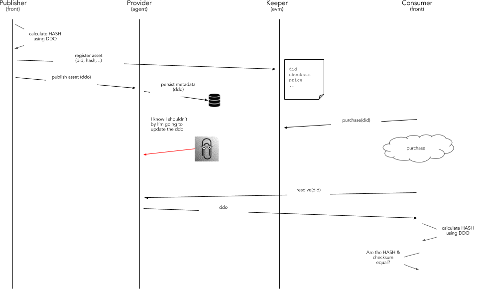

# Open Bounty : Decentralised-Identifier (sample proposal)

## Abstract
A DID is a unique identifier that can be resolved or de-referenced to a standard resource describing the entity (a DID Document or DDO).
If we apply this to Ocean, the DID would be the unique identifier of an object represented in Ocean (ie. the Asset ID of an ASSET or the Actor ID of a USER).
## Motivation

The main motivations of this OEP are:

* Design a solution to extend the current architecture to use **Decentralized Identifiers (DID)** and **DID description objects (DDO)**
* Understand how to register information on-chain with off-chain integrity associated
* Understand how to resolve DID's into DDO's
* Design a solution facilitating to have the on-chain and off-chain information aligned
* Establishing the mechanism to know if the DDO associted to a DID was modified
* Defining the common mechanisms, interfaces and API's to implemented the designed solution
* Define how Ocean assets, agents and tribes can be modeled with a DID/DDO data model
* Understand how DID hubs are formed, and how they integrate a business and storage layer

## Specification

Requirements are:

* The DID resolving capabilities MUST be exposed in the client libraries, enabling to resolve a DDO directly in a totally transparent way
* ASSETS are DATA objects describing RESOURCES under control of a PUBLISHER
* KEEPER stores on-chain only the essential information about ASSETS
* PROVIDERS store the ASSET metadata off-chain
* KEEPER doesn't store any ASSET metadata
* OCEAN doesn't store ASSET files contents
* An ASSET is modeled in OCEAN as on-chain information stored in the KEEPER and metadata stored in OCEANDB
* ASSETS on-chain information only can be modified by OWNERS or DELEGATED USERS
* ASSETS can be resolved using a Decentralized ID (DID) included on-chain and off-chain
* A Decentralized Distributed Object (**DDO**) represents the ASSET metadata
* Any kind of object registered in Ocean SHOULD have a DID allowing to uniquely identify that object in the system
* ASSET DDO (metadata off-chain) is associated to the ASSET information stored on-chain using a common **DID**
* A **DID** can be resolved to get access to a **DDO**
* ASSET DDO's can be updated without updating the on-chain information
* ASSET information stored in the keeper will include a **checksum** attribute
* The ASSET on-chain checksum attribute, includes a one-way HASH calculated using the DDO content
* After the DDO resolving, the DDO HASH can be calculated off-chain to validate if the on-chain and off-chain information is aligned
* A HASH not matching with the checksum on-chain means the DDO was modified without the on-chain update
* The function to calculate the HASH MUST BE standard

## Implementation

The solution included in the above diagram includes the following steps:

1. The PUBLISHER, before publish any ASSET information, calculate the **HASH** using the **DDO** as input.
   To do that, the PUBLISHER will use from the client side a common Ocean library using the same algorithm.
1. The PUBLISHER, in the process of registering an ASSET on-chain specifies the **HASH** in addition of the existing parameters.
1. The KEEPER register the ASSET and associate the HASH calculated using the DDO associated to the ASSET.
1. After a CONSUMER get access to an ASSET, could store internally the HASH referencing to the DDO he purchased
1. In a posterior consumption, after resolving the DDO, the CONSUMER using the client library can calculate the HASH of the DDO just obtained
1. If the HASH obtained is not the same than the HASH associated in the original purchase, means the DDO was modified afterwards
1. This, depending of the agreed conditions, could means an exit clause of some contracts

The HASH could be an optional parameter in the registering of the ASSET. If it's not specified, means the DDO can be updated without any limitation.

## References

* https://w3c-ccg.github.io/did-spec/
* https://github.com/WebOfTrustInfo/rebooting-the-web-of-trust-fall2016/blob/master/topics-and-advance-readings/did-spec-working-draft-03.md

## Open Questions 
## Notes
This sample is referenced from [OEP-7](https://github.com/oceanprotocol/OEPs/tree/master/7) and is intended to be used only as a sample for creating sample proposal for open bounty.

## Your Address
0x2a4fb80440985fc42a8f79dcad00fc6b231a8043
